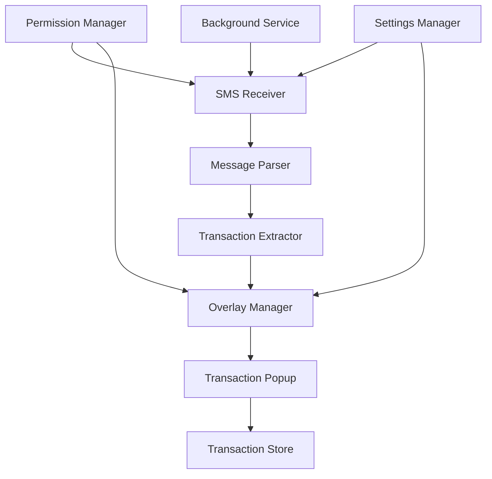

# Design Document

## Overview

The SMS Transaction Detection feature will add automated financial transaction capture capabilities to the expense tracker app. The system will monitor incoming SMS messages, parse financial information using pattern matching and natural language processing, and present transaction details via system overlay popups for user confirmation.

The feature integrates with the existing Expo/React Native architecture and leverages native Android capabilities for SMS reading and system overlay permissions. The design follows a modular approach with clear separation between SMS monitoring, message parsing, and UI presentation layers.

## Architecture

### High-Level Architecture



### Core Components

1. **SMS Monitor Service**: Background service that listens for incoming SMS messages
2. **Message Parser**: Analyzes SMS content to identify financial transactions
3. **Transaction Extractor**: Extracts structured data from financial messages
4. **Overlay Manager**: Handles system overlay permissions and popup display
5. **Transaction Popup Component**: UI component for transaction confirmation
6. **Permission Manager**: Manages SMS and overlay permissions
7. **Settings Manager**: Handles user preferences and configuration

### Technology Stack

- **Framework**: Expo SDK 54+ with React Native 0.81
- **SMS Reading**: `expo-sms` (for SMS access) + native Android broadcast receiver
- **Overlay System**: React Native Modal with system alert window type
- **Background Processing**: Expo TaskManager for background SMS monitoring
- **Permissions**: `expo-permissions` for SMS and overlay permissions
- **Storage**: `expo-secure-store` for sensitive settings
- **Pattern Matching**: JavaScript RegExp with predefined banking patterns

## Components and Interfaces

### 1. SMS Monitor Service

**Purpose**: Continuously monitor incoming SMS messages and filter financial content.

**Key Methods**:
```typescript
interface SMSMonitorService {
  startMonitoring(): Promise<void>
  stopMonitoring(): void
  onMessageReceived(callback: (message: SMSMessage) => void): void
  isMonitoring(): boolean
}

interface SMSMessage {
  id: string
  sender: string
  body: string
  timestamp: Date
  isFinancial?: boolean
}
```

**Implementation Details**:
- Uses Expo TaskManager for background execution
- Registers Android broadcast receiver for SMS_RECEIVED intent
- Filters messages based on sender whitelist and content keywords
- Queues messages for processing when app is not active

### 2. Message Parser

**Purpose**: Analyze SMS content to identify and classify financial transactions.

**Key Methods**:
```typescript
interface MessageParser {
  parseMessage(message: SMSMessage): ParsedTransaction | null
  isFinancialMessage(content: string): boolean
  extractTransactionType(content: string): 'income' | 'expense' | 'unknown'
}

interface ParsedTransaction {
  amount: number
  type: 'income' | 'expense'
  merchant: string
  balance?: number
  account?: string
  timestamp: Date
  rawMessage: string
  confidence: number
}
```

**Implementation Details**:
- Uses predefined regex patterns for different bank formats
- Implements confidence scoring for extraction accuracy
- Supports multiple currency formats and decimal separators
- Handles common banking terminology variations

### 3. Transaction Extractor

**Purpose**: Extract structured financial data from parsed messages.

**Banking Pattern Examples**:
```typescript
const BANKING_PATTERNS = {
  debit: [
    /(?:debited|withdrawn|paid|spent).*?(?:rs\.?|₹)\s*(\d+(?:,\d+)*(?:\.\d{2})?)/i,
    /(?:rs\.?|₹)\s*(\d+(?:,\d+)*(?:\.\d{2})?).*?(?:debited|withdrawn)/i
  ],
  credit: [
    /(?:credited|received|deposited).*?(?:rs\.?|₹)\s*(\d+(?:,\d+)*(?:\.\d{2})?)/i,
    /(?:rs\.?|₹)\s*(\d+(?:,\d+)*(?:\.\d{2})?).*?(?:credited|received)/i
  ],
  balance: [
    /(?:balance|bal).*?(?:rs\.?|₹)\s*(\d+(?:,\d+)*(?:\.\d{2})?)/i,
    /(?:rs\.?|₹)\s*(\d+(?:,\d+)*(?:\.\d{2})?).*?(?:balance|bal)/i
  ],
  merchant: [
    /(?:at|to|from)\s+([A-Z][A-Z0-9\s\-\.]{2,30})/i,
    /"([^"]+)"/,
    /\b([A-Z]{2,}(?:\s+[A-Z]{2,})*)\b/
  ]
}
```

### 4. Overlay Manager

**Purpose**: Handle system overlay permissions and popup display coordination.

**Key Methods**:
```typescript
interface OverlayManager {
  requestOverlayPermission(): Promise<boolean>
  hasOverlayPermission(): Promise<boolean>
  showTransactionPopup(transaction: ParsedTransaction): void
  hidePopup(): void
  canShowOverlay(): boolean
}
```

**Implementation Details**:
- Checks for "Display over other apps" permission
- Manages popup queue when multiple transactions detected
- Handles device lock state and other overlay conflicts
- Falls back to in-app notifications when overlay unavailable

### 5. Transaction Popup Component

**Purpose**: Display transaction confirmation UI as system overlay.

**Component Structure**:
```typescript
interface TransactionPopupProps {
  transaction: ParsedTransaction
  onAddTransaction: (transaction: TransactionData) => void
  onDismiss: () => void
  visible: boolean
}

interface TransactionData {
  title: string
  amount: number
  type: 'income' | 'expense'
  category: string
  account?: string
  date: Date
}
```

**UI Features**:
- Slide-up animation from bottom of screen
- Editable transaction title field
- Category selection buttons
- Add/Dismiss action buttons
- Auto-dismiss after 30 seconds
- Glassmorphic design matching app theme

## Data Models

### Transaction Model
```typescript
interface Transaction {
  id: string
  title: string
  amount: number
  type: 'income' | 'expense'
  category: string
  account: string
  date: Date
  source: 'manual' | 'sms'
  smsId?: string
  confidence?: number
  createdAt: Date
  updatedAt: Date
}
```

### SMS Settings Model
```typescript
interface SMSSettings {
  enabled: boolean
  trustedSenders: string[]
  popupDuration: number // seconds
  useOverlay: boolean
  autoCategories: Record<string, string>
  minimumAmount: number
}
```

### Permission State Model
```typescript
interface PermissionState {
  smsPermission: 'granted' | 'denied' | 'not-requested'
  overlayPermission: 'granted' | 'denied' | 'not-requested'
  lastChecked: Date
}
```

## Error Handling

### Permission Errors
- **SMS Permission Denied**: Show settings screen with explanation and manual permission request
- **Overlay Permission Denied**: Fall back to in-app notifications with reduced functionality
- **Permission Revoked**: Detect permission changes and update UI accordingly

### Parsing Errors
- **Unrecognized Format**: Log message for pattern improvement, show generic transaction popup
- **Ambiguous Amount**: Prompt user for manual amount entry
- **Missing Critical Data**: Mark fields as "unknown" and allow user input

### System Errors
- **Background Service Failure**: Restart service automatically, notify user if persistent
- **Overlay Display Failure**: Queue popup for retry, fall back to notification
- **Storage Errors**: Use in-memory fallback, sync when storage available

### Network and Performance
- **High Message Volume**: Implement rate limiting and message queuing
- **Low Memory**: Reduce background processing, clear message cache
- **Battery Optimization**: Respect system battery optimization settings

## Testing Strategy

### Unit Testing
- **Message Parser Tests**: Test regex patterns against sample bank SMS messages
- **Transaction Extractor Tests**: Verify data extraction accuracy across different formats
- **Permission Manager Tests**: Mock permission states and verify handling
- **Overlay Manager Tests**: Test popup display logic and queue management

### Integration Testing
- **SMS Flow Tests**: End-to-end testing from SMS receipt to transaction creation
- **Permission Flow Tests**: Test permission request and fallback scenarios
- **Background Service Tests**: Verify service lifecycle and message processing
- **UI Integration Tests**: Test popup display and user interaction flows

### Device Testing
- **Android Version Compatibility**: Test across Android 8+ devices
- **Different Screen Sizes**: Verify popup display on various screen dimensions
- **Performance Testing**: Monitor memory usage and battery impact
- **Bank Message Testing**: Test with real SMS messages from major banks

### User Acceptance Testing
- **Permission Onboarding**: Test user experience for permission requests
- **Transaction Accuracy**: Verify extracted data matches actual transactions
- **Popup Usability**: Test popup interaction and customization features
- **Settings Management**: Test configuration options and their effects

## Security Considerations

### SMS Data Privacy
- **Message Storage**: Never store complete SMS content, only extracted transaction data
- **Sensitive Information**: Mask account numbers and personal details in logs
- **Data Encryption**: Encrypt stored transaction data using expo-secure-store
- **Access Control**: Limit SMS access to financial messages only

### Permission Security
- **Minimal Permissions**: Request only necessary permissions (SMS read, overlay)
- **Permission Validation**: Regularly verify permissions are still granted
- **Graceful Degradation**: Maintain functionality when permissions are limited
- **User Control**: Provide clear options to disable SMS monitoring

### Background Processing
- **Resource Limits**: Implement processing limits to prevent abuse
- **Service Isolation**: Isolate SMS processing from main app functionality
- **Error Boundaries**: Prevent SMS processing errors from crashing main app
- **Audit Logging**: Log permission usage and processing activities

## Performance Optimization

### Background Processing
- **Efficient Filtering**: Quick keyword filtering before expensive parsing
- **Batch Processing**: Process multiple messages together when possible
- **Memory Management**: Clear processed message cache regularly
- **CPU Throttling**: Limit processing during low battery or thermal throttling

### UI Performance
- **Lazy Loading**: Load popup components only when needed
- **Animation Optimization**: Use native animations for smooth popup transitions
- **Memory Cleanup**: Properly dispose of popup components after use
- **Render Optimization**: Minimize re-renders during popup display

### Storage Optimization
- **Efficient Queries**: Index transaction data for quick retrieval
- **Data Compression**: Compress stored transaction patterns and settings
- **Cache Management**: Implement LRU cache for frequently accessed data
- **Background Sync**: Sync data efficiently without blocking UI